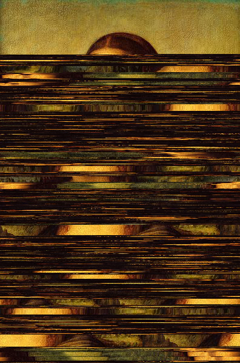

# markov-art

Markov chain image generator

## Installation
```sh
git clone https://github.com/flxn/markov-art.git
cd markov-art/
go build
```

## How to use
```
$ ./markov-art --help
Usage: ./markov-art [flags] inputFile outputFile
Flags:
 -o Markov chain of n-th order (Default: 1)
 -horizontal Horizontal line scanning (Default: Vertical if omitted)
 -h Print help
Arguments:
 inputFile Path to input image
 outputFile Path to output image (must be *.png)
```

## Example
```sh
./markov-art -o 4 -horizontal monalisa.jpg example.png
```

